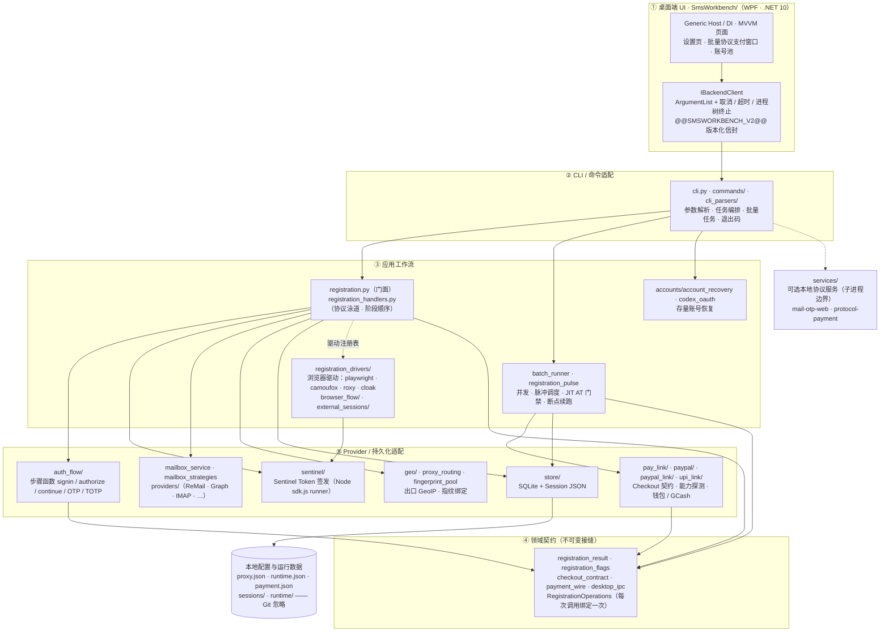

<div align="center">
  
  <h1>GPT-Register-Tool</h1>
  <p><strong>面向 Windows 的 ChatGPT 账号注册、邮箱 OTP、账号管理与支付工作台</strong><br>
  <em>A Windows desktop workbench for ChatGPT account registration, email OTP, account management, and payment workflows.</em></p>
  <p>
    <a href="./README.md">简体中文</a> · <a href="./README_EN.md">English</a>
  </p>
  <p>
    
    
    
  </p>
</div>

## 简介

GPT-Register-Tool 采用 **WPF 桌面端 + Python 业务核心**，提供邮箱 OTP 注册、账号与 Session 管理、代理配置、协议支付链接提取和账号导出能力。运行数据默认保存在本机，不写入 Git。

当前发布说明：[release-v2026.10.08.md](docs/releases/release-v2026.10.08.md)。


## 赞助商


[IPWO](https://www.ipwo.net)全球住宅代理为 ChatGPT 自动化工具提供全球住宅代理资源，支持多地区 IP 选择及灵活的代理配置。<br>
适用于注册代理、独立网络环境及自动化任务等场景，帮助开发者根据项目需求配置合适的网络出口。<br>
包含动态静态IP资源，支持免费测试。[IPWO测试入口](https://www.ipwo.net/?ref=githubGPT)

## 功能亮点

| 模块 | 能力要点 |
| --- | --- |
| **一键注册** | 邮箱池 / ReMail 长效邮箱 / CFWorker 域名邮箱 / iCloud 接码链接，配多供应商手机接码；单账号与并发批量；每个账号独立提取 Sentinel Token 与 `oai-did`，不跨账号复用认证事务；成功判定为 AT 探测 HTTP 200；注册只保存 AT/Session，不生成支付链接 |
| **协议一致性与恢复** | 领取或购买邮箱前预检 ChatGPT / Auth / Sentinel 三段网络；账号 ↔ 代理会话绑定，只在故障时换出口；NextAuth / Auth / ChatGPT 共享稳定的 `oai-did`、UA 与 client hints，指纹语言与时区随出口 GeoIP；403/429 熔断且不做纯 HTTP PoW 降级；创建账号后先持久化断点再探活，可从断点恢复且不重复烧 OTP |
| **邮箱与 OTP** | 统一 mailbox seam：ReMail、Smailr、CFWorker、Microsoft Graph/OAuth、Outlook/Hotmail IMAP、Gmail、iCloud 接码链接与历史邮箱池格式；OTP 按主题、发件人、精确收件人、服务端时间戳过滤并排序；ReMail 支持自适应轮询、详情正文补取与 30s 内重发 |
| **协议支付提链** | 15 种方式：PayPal、GoPay、GCash、GrabPay、UPI、iDEAL、PIX、Kakao Pay、BLIK、TWINT、直卡 Checkout、MoMo、QRIS、Bizum、Naver Pay（后三者为 CLI canary）；Checkout 与 Approve 使用彼此独立的出口池，按支付方法改写国家与 Session；严格区分 Checkout / Promotion / PM / Confirm / Poll / Provider Redirect 阶段；统一五态终态并附 `retryable` 与 `error_stage`，`unknown` 须先对账 |
| **批量协议支付** | JIT AT 门禁、HTTP 401 分层恢复（RT → Cookie → 隔离浏览器邮箱 OTP → Codex OAuth）、支付资格矩阵、Canary 暂停、方法级并发、原子断点与显式续跑；报告分开统计 AT 200、资格、支付方式可见性、Approve 与最终链接/二维码产物 |
| **Agent Identity 与 SUB2API** | 注册主流程不含 Agent Identity，其失败不改变 AT 200 结果；新建/重建只能走显式 SUB2API 导入；Ed25519 PKCS#8 私钥独立存放且不入日志；导入支持 `auto` / `oauth` / `agent_identity` 三种模式 |
| **账号与数据管理** | Session JSON + SQLite 双层索引；账号测活与 401 恢复；优惠状态与支付资格徽章（默认只查套餐/试用，显式入口才创建一次性 Checkout 并读取支付方式证据）；Codex / CPA / SUB2API 导入导出；本地数据在 `sessions/` 与 `runtime/`，均被 Git 忽略 |
| **桌面端操作** | 勾选账号后走「批量协议支付」窗口（并发、重试、Canary、两个出口池、断点续跑）；注册批次每输出一次 `Saved session:` 即防抖刷新账号池；多选删除合并为一次后端批量命令 |
| **手机接码** | SMSBower、HeroSMS、Grizzly、NexSMS 的供应商选择与在线目录查询（可用性依供应商协议），支持发送重试、超时与轮询间隔配置；详见 [当前接码契约](docs/current/one-click-sms.md) |


### 架构总览

项目按 **① UI → ② CLI / 命令适配 → ③ 应用工作流 → ④ 领域契约 → ⑤ Provider / 持久化适配** 五层组织，导入只指向内层，下层从不反向依赖上层。配置与运行数据落在仓库外（Git 忽略）。注册泳道分协议（内置默认）与浏览器驱动两条，二者共用同一套邮箱 OTP、Session 提取与 AT 探活边界。



更详细的边界说明见 [架构说明](docs/architecture.md)，目录职责见 [目录职责](docs/directory-map.md)。


## 部署方式

### 环境要求

- Windows 10/11 x64。
- Python 3.10 或更高版本。
- `curl_cffi==0.16.0`。注册预检会校验安装版本和 `chrome146` profile；旧版本不会进入邮箱采购或注册阶段。
- .NET 10 Desktop Runtime；从源码编译时需要 .NET 10 SDK。
- **Node.js 18+**（`node` 需在 PATH）：Sentinel Token 的 quickjs 提取器用 `node` 运行 OpenAI 真实 `sdk.js`，缺失会导致注册阶段 OTP 静默丢失。
- **Playwright Chromium**：MoMo/直卡等协议支付的 Stripe init 走 Chromium 网络栈完成 TLS，需执行 `python -m playwright install chromium`。
- 可正常访问目标邮箱、ChatGPT 和支付服务的网络环境。
- 注册代理、邮箱收件代理和协议支付代理彼此独立；邮箱收件默认使用本地 `http://127.0.0.1:7897`。

安装依赖后，可运行环境预检确认 Node.js、Playwright Chromium 和关键 Python 包就绪：

```powershell
python scripts/preflight_env.py
```

### 方式一：安装包

从 GitHub Releases 下载最新的：

```text
GPT-Register-Tool-Setup-vYYYY.MM.DD.exe
```

运行安装器并选择安装目录。首次启动前仍需安装 Python 依赖，并创建本地配置：

```powershell
python -m pip install -r requirements.txt -c constraints.txt
copy config.example.json config.json
```

### 方式二：便携压缩包

下载并解压：

```text
GPT-Register-Tool-win-x64-vYYYY.MM.DD.zip
```

在解压目录执行：

```powershell
python -m pip install -r requirements.txt -c constraints.txt
copy config.example.json config.json
.\dist\net10\SmsWorkbench.exe
```

### 方式三：从源码运行

```powershell
git clone https://github.com/2951461586/GPT-Register-Tool.git
cd GPT-Register-Tool
python -m pip install -r requirements.txt -c constraints.txt
copy config.example.json config.json
powershell -ExecutionPolicy Bypass -File .\SmsWorkbench\build_dotnet.ps1
.\dist\net10\SmsWorkbench.exe
```

桌面程序只能通过 `SmsWorkbench/build_dotnet.ps1` 编译。不要直接运行 `dotnet build`，因为它只产生中间文件，不会更新标准工作区 `dist/net10`。

### 首次配置

打开桌面端的 **设置** 页面，至少完成以下配置：

1. 在 **网络与支付** 中配置注册代理池和邮箱收件代理；协议支付的 Checkout / Approve 两个代理池在“批量协议支付”窗口中按支付方式保存。
2. 在 **邮箱与收信** 中配置 ReMail、CFWorker 或其他邮箱源。
3. 按需配置 SMSBower、CPA、SUB2API 和各协议支付参数。
4. 保存后重新打开对应功能即可使用新配置。

注册驱动在 **设置 -> 注册与接码 -> 注册驱动** 中选择，默认仍为 `protocol`。选择浏览器驱动后，注册会复用同一套邮箱 OTP、Session 提取、AT HTTP 200 探活和本地持久化边界：

- `playwright`：本机 Chromium，通过 Playwright 启动。
- `roxy`：连接本机 RoxyBrowser API 创建/打开 Profile，再通过 CDP 接管。
- `cloak`：调用已安装的 CloakBrowser Python SDK。
- `camoufox`：调用已安装的 Camoufox 反检测浏览器（**当前默认浏览器驱动**）。

RoxyBrowser 的 API/会话配置位于同一设置页的独立分区；CloakBrowser 的 License Key、持久化目录和指纹参数也在那里配置。未配置所选驱动的必需字段时，任务会返回脱敏的配置错误，不会回退到协议注册。浏览器驱动不绕过 CAPTCHA；遇到人工挑战会以 `manual_challenge_required` 结束，保留现有账号状态。

浏览器注册默认启用 **脉冲调度**（`registration.pulse`，波次间隔 + OTP-ban 暂停）与 **浏览器进程池**（`registration.browser_process_pool`，按进程复用浏览器上下文、按健康度回收）。二者与「账号 ↔ 代理槽绑定」协同：每个账号在整个生命周期内固定走同一个注册出口，重试时只刷新会话 sid，不切换代理成员——避免出口轮换被注册方判定为代理抖动而封禁。进程池哈希键按 `(driver, headless, timeout)` 缓存，使同一出口、同一头部配置的账号复用同一浏览器进程，降低冷启动开销。

ReMail API Key 也可以通过环境变量提供：

```powershell
$env:REMAIL_API_KEY = "rk-your-key"
```

环境变量优先于 `config.json`。桌面设置页保存的 API Key 仅写入本地且被 Git 忽略的 `config.json`。

## 许可证与使用责任

本项目以 **MIT License** 发布，全文见 [LICENSE](LICENSE)：

```text
MIT License

Copyright (c) 2026 GPT-Register-Tool contributors

Permission is hereby granted, free of charge, to any person obtaining a copy
of this software and associated documentation files (the "Software"), to deal
in the Software without restriction, including without limitation the rights
to use, copy, modify, merge, publish, distribute, sublicense, and/or sell
copies of the Software, and to permit persons to whom the Software is
furnished to do so, subject to the following conditions:

The above copyright notice and this permission notice shall be included in all
copies or substantial portions of the Software.

THE SOFTWARE IS PROVIDED "AS IS", WITHOUT WARRANTY OF ANY KIND, EXPRESS OR
IMPLIED, INCLUDING BUT NOT LIMITED TO THE WARRANTIES OF MERCHANTABILITY,
FITNESS FOR A PARTICULAR PURPOSE AND NONINFRINGEMENT. IN NO EVENT SHALL THE
AUTHORS OR COPYRIGHT HOLDERS BE LIABLE FOR ANY CLAIM, DAMAGES OR OTHER
LIABILITY, WHETHER IN AN ACTION OF CONTRACT, TORT OR OTHERWISE, ARISING FROM,
OUT OF OR IN CONNECTION WITH THE SOFTWARE OR THE USE OR OTHER DEALINGS IN THE
SOFTWARE.
```

请仅在获得授权并符合相关服务条款、地区法规及组织政策的场景中使用本项目。使用者需要自行承担第三方邮箱、代理、接码与支付服务的费用、账号安全和数据合规责任；示例配置不包含任何真实凭据。
