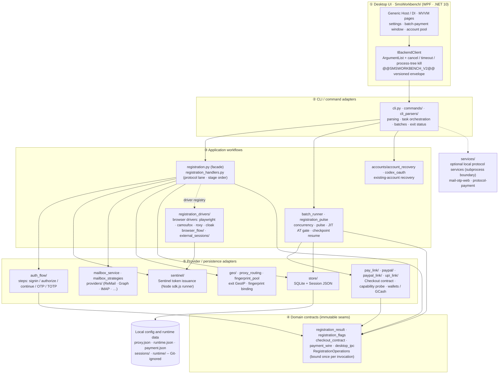

<div align="center">
  
  <h1>GPT-Register-Tool</h1>
  <p><strong>A Windows desktop workbench for ChatGPT account registration, email OTP, account management, and payment workflows</strong></p>
  <p>
    <a href="./README.md">简体中文</a> · <a href="./README_EN.md">English</a>
  </p>
  <p>
    
    
    
  </p>
</div>

## Introduction

GPT-Register-Tool combines a **WPF desktop client with a Python core** for email OTP registration, account and Session management, proxy configuration, payment-link extraction, and account export. Runtime data is stored locally by default and is not committed to Git.

Current release notes: [v2026.10.08](./docs/releases/release-v2026.10.08.md).


## Sponsor


[IPWO](https://www.ipwo.net) provides global residential proxy resources for ChatGPT automation tools, with multi-region IP selection and flexible proxy configuration.<br>
It is suitable for registration proxies, isolated network environments, and automation tasks that require project-specific network exits.<br>
Dynamic and static IP resources are available with free testing through the [IPWO trial portal](https://www.ipwo.net/?ref=githubGPT).


## Highlights

| Area | Capability |
| --- | --- |
| **Registration** | Mailbox pools / ReMail long-lived mailboxes / CFWorker domains / iCloud relay links plus multi-vendor SMS; single and concurrent batches; each account mints its own Sentinel token and `oai-did`; success means the AT probe answered HTTP 200; registration only stores the AT/Session and never builds payment links |
| **Protocol consistency and recovery** | Preflight of the ChatGPT / Auth / Sentinel hops before a mailbox is spent; one proxy session per account, rotated only on failure; NextAuth / Auth / ChatGPT share a stable `oai-did`, UA and client hints with GeoIP-derived locale and timezone; 403/429 opens a circuit with no plain-HTTP PoW fallback; the checkpoint is persisted before the AT probe so a resume never re-spends an OTP |
| **Mailbox and OTP** | One mailbox seam: ReMail, Smailr, CFWorker, Microsoft Graph/OAuth, Outlook/Hotmail IMAP, Gmail, iCloud relay links and legacy pool formats; OTP parsing filters by subject, sender, exact recipient and server timestamp, then ranks candidates; ReMail adds adaptive polling, detail-body fetch and a 30s resend |
| **Protocol payment links** | 15 methods: PayPal, GoPay, GCash, GrabPay, UPI, iDEAL, PIX, Kakao Pay, BLIK, TWINT, direct card Checkout, MoMo, QRIS, Bizum, Naver Pay (the last three are CLI canaries); Checkout and Approve use separate exit pools and rewrite country and Session per method; Checkout / Promotion / PM / Confirm / Poll / Provider Redirect stay distinct stages; five terminal states with `retryable` and `error_stage`, and `unknown` must be reconciled first |
| **Batch payment** | JIT AT gate, layered HTTP 401 recovery (RT -> Cookie -> isolated browser mailbox OTP -> Codex OAuth), eligibility matrix, Canary pause, per-method concurrency, atomic checkpoints and explicit resume; the report separates AT 200, eligibility, visible payment methods, approve and final link/QR artifacts |
| **Agent Identity and SUB2API** | The registration flow has no Agent Identity stage and its failure cannot change the AT 200 verdict; creation/rebuild only happens through the explicit SUB2API import; the Ed25519 PKCS#8 key is stored separately and never logged; import supports `auto` / `oauth` / `agent_identity` |
| **Accounts and data** | Session JSON plus SQLite dual index; liveness probe and 401 recovery; promotion and payment-eligibility badges (plan/trial only by default, an explicit entry point creates a one-shot Checkout to read payment-method evidence); Codex / CPA / SUB2API import-export; local data lives in `sessions/` and `runtime/`, both Git-ignored |
| **Desktop operations** | Selected accounts drive the "batch protocol payment" window (concurrency, retries, Canary, two exit pools, checkpoint resume); each `Saved session:` debounces an account-pool refresh; multi-select delete is one backend batch command |
| **SMS** | SMSBower, HeroSMS, Grizzly and NexSMS provider selection with online catalog lookup (availability depends on each vendor), plus send retry, timeout and poll-interval settings; see the [one-click SMS contract](docs/current/one-click-sms.md) |


### Architecture

Five layers — **① UI → ② CLI / command adapters → ③ application workflows → ④ domain contracts → ⑤ provider / persistence adapters**. Imports point inward only; a lower layer never imports a higher one. Configuration and runtime data live outside the repository (Git-ignored). Registration has two lanes — protocol (the built-in default) and browser drivers — sharing one mailbox-OTP, session-extraction and AT-probe boundary.



See [architecture](docs/architecture.md) for boundaries and [directory map](docs/directory-map.md) for ownership.


## Installation

### Requirements

- Windows 10/11 x64.
- Python 3.10 or later.
- .NET 10 Desktop Runtime; the .NET 10 SDK is required when building from source.
- Node.js 18 or later available on `PATH`.
- Playwright Chromium for browser-assisted payment workflows and browser registration.

### Installation

Download the latest installer or portable archive from [GitHub Releases](https://github.com/2951461586/GPT-Register-Tool/releases), or build the desktop application from source:

```powershell
git clone https://github.com/2951461586/GPT-Register-Tool.git
cd GPT-Register-Tool
python -m pip install -r requirements.txt -c constraints.txt
copy config.example.json config.json
powershell -ExecutionPolicy Bypass -File .\SmsWorkbench\build_dotnet.ps1
.\dist\net10\SmsWorkbench.exe
```

The supported desktop build command is `SmsWorkbench/build_dotnet.ps1`. Its output is written to `dist/net10/SmsWorkbench.exe`.

### Configuration ownership

The active configuration lives in `proxy.json`, `runtime.json` and
`payment.json`. If any shard exists, only existing shards are merged, in that
order. Legacy `config.json` is used and migrated only when no shards exist.
Do not edit a legacy file expecting it to override active shards.

`config_schema.json` is a shared ownership manifest, not JSON Schema. Runtime
validation remains in Python config/driver preflight. Local configuration files
contain credentials and must stay ignored. See
[configuration ownership](docs/current/configuration.md).


## License And Responsible Use

Released under the **MIT License**; the full text is in [LICENSE](LICENSE).

```text
MIT License

Copyright (c) 2026 GPT-Register-Tool contributors

Permission is hereby granted, free of charge, to any person obtaining a copy
of this software and associated documentation files (the "Software"), to deal
in the Software without restriction, including without limitation the rights
to use, copy, modify, merge, publish, distribute, sublicense, and/or sell
copies of the Software, and to permit persons to whom the Software is
furnished to do so, subject to the following conditions:

The above copyright notice and this permission notice shall be included in all
copies or substantial portions of the Software.

THE SOFTWARE IS PROVIDED "AS IS", WITHOUT WARRANTY OF ANY KIND, EXPRESS OR
IMPLIED, INCLUDING BUT NOT LIMITED TO THE WARRANTIES OF MERCHANTABILITY,
FITNESS FOR A PARTICULAR PURPOSE AND NONINFRINGEMENT. IN NO EVENT SHALL THE
AUTHORS OR COPYRIGHT HOLDERS BE LIABLE FOR ANY CLAIM, DAMAGES OR OTHER
LIABILITY, WHETHER IN AN ACTION OF CONTRACT, TORT OR OTHERWISE, ARISING FROM,
OUT OF OR IN CONNECTION WITH THE SOFTWARE OR THE USE OR OTHER DEALINGS IN THE
SOFTWARE.
```

Use this project only with authorization and in compliance with applicable service terms, regional laws, and organizational policies. You are responsible for third-party mailbox, proxy, SMS and payment costs, account security, and data compliance; the sample configuration contains no real credentials.
